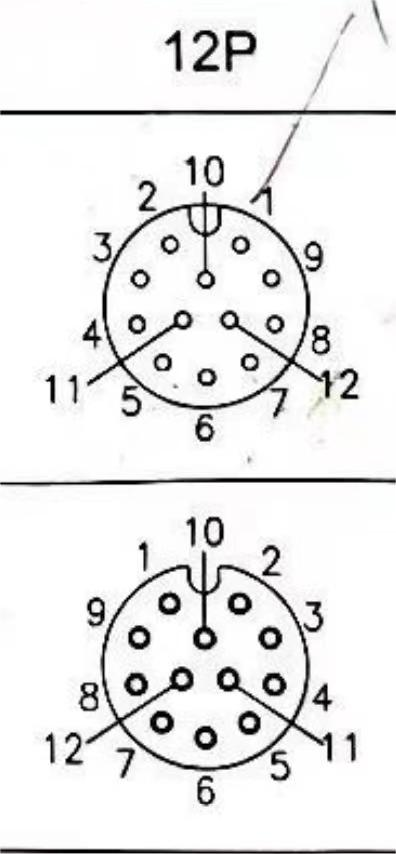
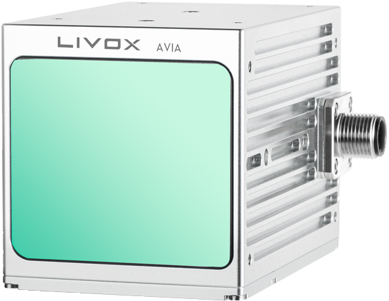
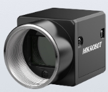
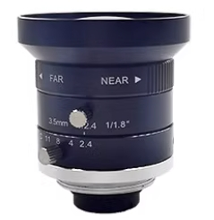
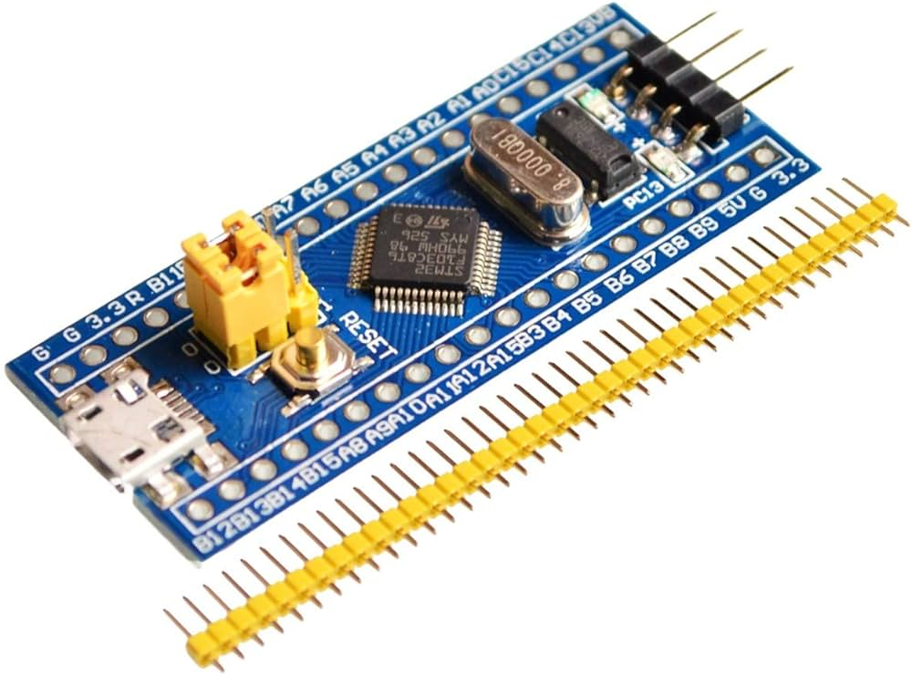
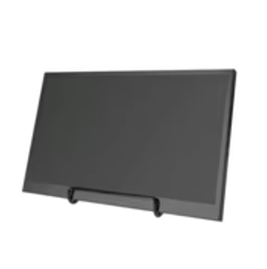
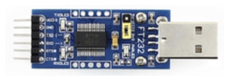
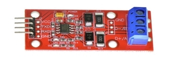

# [LiDAR_Inertial_Visual_Handhold](https://zhuanlan.zhihu.com/p/670136001)

### News
* **`28 June 2024`:** Update reproduction videos and some important notes.
* **`27 May 2024`:** Fix a bug in the calculation of the synthetic GPRMC timestamp, which could cause timestamp rollback. Additionally, we add checksum verification for GPRMC.
* **`20 May 2024`:** According to Livox Avia's pin requirements, we convert PPS TTL level to RS485 level and supplement it with more detailed electronic connection and material list.

## 1. Introduction
This repository provides the **CAD files** (with suffix “\*.SLDPRT and \*.SLDASM”) for our handheld device, which can be opened and edited with [*Solidworks*](https://www.solidworks.com). All of the modules are suitable for printing with [*FDM (Fused Deposition Modeling)*](https://en.wikipedia.org/wiki/Fused_filament_fabrication). In addition, we have also open-sourced our **hardware synchronization scheme**, as well as the **STM32 source code** and **hardware wiring configuration** instructions.

<div align="center">

</div>

## 2. Relevant guidance video 

Thanks to the Bilibili uploader [GundaSmart](https://space.bilibili.com/687639149?spm_id_from=333.788.0.0) for making a detailed reproduction video. Everyone can follow the video to reproduce it. His sensor configuration includes a MID360 and a Hikvision pinhole camera.

[FAST-LIVO Reproduction (Part 1)](https://www.bilibili.com/video/BV1T142197ci/?share_source=copy_web&vd_source=f77407286e8f0ee71b845d76498ada9d)

[FAST-LIVO Reproduction (Part 2)](https://www.bilibili.com/video/BV14T421X7m9/?share_source=copy_web&vd_source=f77407286e8f0ee71b845d76498ada9d)

[FAST-LIVO Reproduction (Part 3)](https://www.bilibili.com/video/BV16E42137ru/?share_source=copy_web&vd_source=f77407286e8f0ee71b845d76498ada9d)

[FAST-LIVO Reproduction (Part 4)](https://www.bilibili.com/video/BV1Yb421i7xK/?share_source=copy_web&vd_source=f77407286e8f0ee71b845d76498ada9d)

[FAST-LIVO Reproduction (Part 5)](https://www.bilibili.com/video/BV1Jz421b7px/?share_source=copy_web&vd_source=f77407286e8f0ee71b845d76498ada9d)

## 3. Guide to installation
### 3.1 Root directory

    ├── handhold_cad/ - CAD source files
    │   ├── ...
    ├── livox_ros_driver/ - Livox LiDAR ROS driver
    │   ├── ...
    ├── livox_sdk/ - Livox LiDAR SDK
    │   ├── ...
    ├── mvs_ros_pkg/ - Camera driver
    │   ├── ...
    └── stm32_timersync-open/ - Embedded engineering folder
    │   ├── USER/ - Main functionality folder
    │   ├── ...
    └── README.md - Project homepage document
    └── ...
**Note: In the `livox_lidar_msg.launch` and `left_camera_trigger.yaml` files, change the `path_for_time_stamp` to your own path.**

### 3.2 Assembly instruction

The assembly instructions are demonstrated in the GIFs below. Each module is clearly labeled corresponding to the name of its STL file.

<p align="center">
  
  
</p>

### 3.3 Electronic connection
The guide for the electronic connections is presented as follows:

<table>
  <tr>
    <th>Livox AVIA LiDAR M12</th>
    <th>Peripheral Function</th>
    <th>Diagram</th>
  </tr>
  <tr>
    <td>PIN 1</td>
    <td>Power: +</td>
    <td rowspan="8" align="center">
      <br>
      <span style="display: block; text-align: center;">AVIA 12-Pin Interface, top: female bottom: male</span>
    </td>
  </tr>
  <tr>
    <td>PIN 2</td>
    <td>Ground</td>
  </tr>
  <tr>
    <td>PIN 7</td>
    <td>Ethernet: RX-</td>
  </tr>
  <tr>
    <td>PIN 6</td>
    <td>Ethernet: RX+</td>
  </tr>
  <tr>
    <td>PIN 5</td>
    <td>Ethernet: TX-</td>
  </tr>
  <tr>
    <td>PIN 4</td>
    <td>Ethernet: TX+</td>
  </tr>
  <tr>
    <td>PIN 11 (Sync-)</td>
    <td>RS485_B</td>
  </tr>
  <tr>
    <td>PIN 12 (Sync+)</td>
    <td>RS485_A</td>
  </tr>
</table>

**Note:**
* **STM32 PB5 (PPS signal) is converted from TTL to RS-485, resulting in RS-485_A and RS-485_B;**
* **STM32 TXD (GPRMC) is converted from TTL to USB and sent to the PC;** 
* **If you are using the Mid360, you can directly connect STM32 PB5 to LiDAR M12 pps interface (Sync+).**

<table>
  <tr>
    <th>MVS Camera 6PIN</th>
    <th>Name</th>
    <th>I/O Type</th>
    <th>Description</th>
    <th>Peripheral Function</th>
    <th>Diagram</th>
  </tr>
  <tr>
    <td>PIN 1</td>
    <td>DC_PWR</td>
    <td>--</td>
    <td>Power Supply</td>
    <td></td>
    <td rowspan="8" style="text-align: center;">
      <br>
      <span style="display: block; text-align: center;">MVS Camera 6-Pin Interface</span>
    </td>
  </tr>
  <tr>
    <td>PIN 2</td>
    <td>OPTO_IN</td>
    <td>Line 0+</td>
    <td>Optical Isolation Input</td>
    <td>STM32 PA1</td>
  </tr>
  <tr>
    <td>PIN 3</td>
    <td>GPIO</td>
    <td>Line 2+</td>
    <td>General Purpose Input/Output</td>
    <td></td>
  </tr>
  <tr>
    <td>PIN 4</td>
    <td>OPTO_OUT</td>
    <td>Line 1+</td>
    <td>Optical Isolation Output</td>
    <td></td>
  </tr>
  <tr>
    <td>PIN 5</td>
    <td>OPTO_GND</td>
    <td>Line 0- / 1-</td>
    <td>Optical Isolation Ground</td>
    <td>STM32 GND</td>
  </tr>
  <tr>
    <td>PIN 6</td>
    <td>GND</td>
    <td>Line 2-</td>
    <td>Ground</td>
    <td></td>
  </tr>
</table>

## 4. Main Material lists (only for reference)
| Item  | Pics  | Purchasing list  |
| :------------: | :------------: | :------------: |
| Livox Avia LiDAR  |  | [Livox Avia](https://store.dji.com/hk-en/product/livox-avia) |
| CMOS |  | [MV-CA013-21UC ](https://www.hikrobotics.com/en/machinevision/productdetail?id=1314&pageNumber=1&pageSize=50) |
| Camera Len |  | [ MVL-HF0628M-6MPE](https://m.tb.cn/h.gXmtLRX2UYzGDzH?tk=hIS7WGPOY0y) |
| STM32 |  | [STM32F103C8T6](https://m.tb.cn/h.ggkS9Kp?tk=orRfWz6M784) |
| Screen |  | [IPS Screen 10''](https://m.tb.cn/h.ggkhQ7e?tk=LntBWz6mHDL) |
| Battery |  | [4800mah](https://m.tb.cn/h.g5vJI7a?tk=ofKdWz6OYQm) |
| TTL to USB |  | [TTL to USB](https://m.tb.cn/h.gWzMxzBSkhSqkH3?tk=N1j3WEzIP9u) |
| TTL to 485 |  | [TTL to 485](https://m.tb.cn/h.g3SEkso?tk=eER4WEzFYmP) |

## 5. License
The source code is released under [GPLv3](http://www.gnu.org/licenses/) license. 

If you use any code of this repo in your academic research, it will be **very appreciated** if you can cite any of our following papers:

```
[1] Zheng, Chunran, et al. "FAST-LIVO: Fast and Tightly-coupled Sparse-Direct LiDAR-Inertial-Visual Odometry." 
[2] Hong, Sheng, et al. "Rollvox: real-time and high-quality LiDAR colorization with rolling shutter camera." 
```
