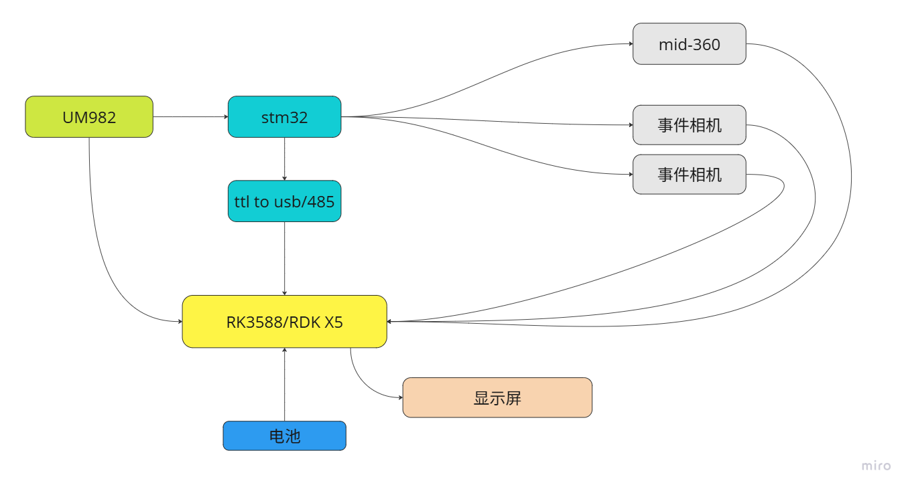
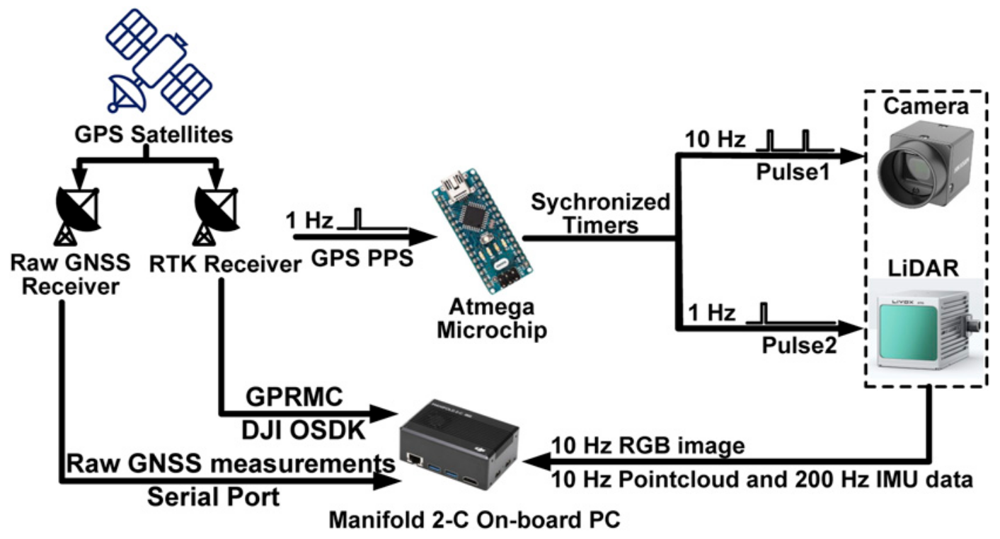
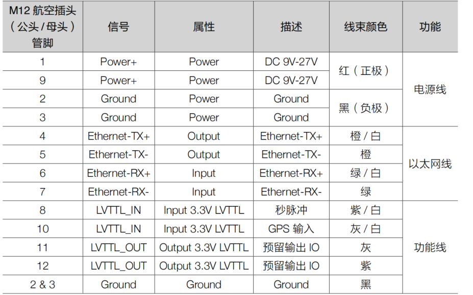
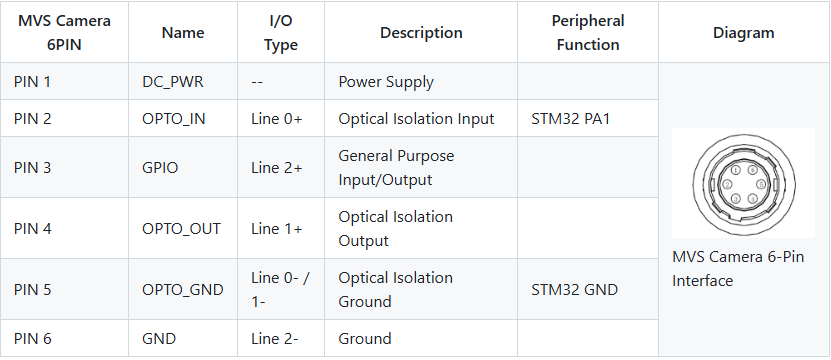
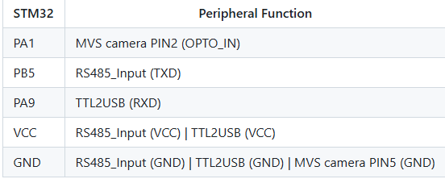

# 多传感器融合SLAM采集平台硬件方案

## 硬件配置清单

| 设备 | 型号 | 数量 | 说明 |
|------|------|------|------|
| 主控 | RDK X5 | 1 | 用于运行SLAM算法 |
| 激光雷达 | mid-360 | 1 | 用于环境感知和建图 |
| IMU | mid-360内置 | 1 | 用于姿态估计和运动补偿 |
| RTK | UM-982 | 1 | 用于绝对定位和航向估计 |
| 摄像头 | 海康MV-CA013-21UC | 2 | 视觉感知 |
| TTL to USB/485 | 转换器 | 1 | 连接STM32和主控 |
| 显示屏 | 10寸 | 1 | 建图实时显示(可选) |
| 电池 | 10000mAh | 1 | 为系统提供稳定电源 |

## 逻辑设计

## 物理接口
### lidar

### camera

### STM32

## 初步分工
1. 硬件采购——施云涛
2. STM32时间同步代码研究及开发——周子杰
3. lidar+camera同步信号输入研究——周子杰
4. UM-982模块硬件接口与通信协议研究及开发——施云涛

## ref
- [LIV_handhold项目](https://github.com/xuankuzcr/LIV_handhold)
- [MARS-LVIG Dataset](https://mars.hku.hk/dataset.html)
- [FAST-LIVO](https://github.com/hku-mars/FAST-LIVO)
- [FAST-LIVO2](https://github.com/hku-mars/FAST-LIVO2)
- [FAST-LIVO2问题220](https://github.com/hku-mars/FAST-LIVO2/issues/220)

